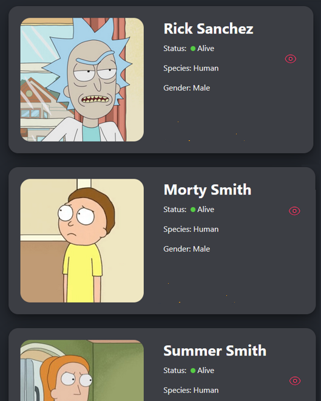
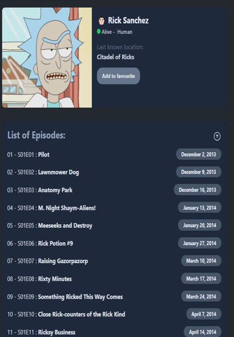

# Rick-and-Morty

The Rick and Morty API is a RESTful and GraphQL API based on the television show Rick and Morty. You will access to data about hundreds of characters, images, locations and episodes. The Rick and Morty API is filled with canonical information as seen on the TV show.

# Demo

These are the app's screenshots(follow the route):

- Header Website


 - Left side



 - Right side




# What I learned

- Fetching data from the internet
- Running asynchronous operations
- Displaying actionable and contextual data using a backdrop

# API

This project uses the amazing [Rick and Morty API](https://rickandmortyapi.com).   

# Tecnologies

* JavaScript (React Library)
* CSS
* HTML
* Single-page Web Applications (SPA)
* Block Element Modifier (BEM)

# Run locally

```
git clone https://github.com/abiasV/Rick-and-Morty.git
```
```
cd rick-and-morty
```
```
npm i
```
```
npm run dev
```
